# Cisco Network Security Labs

This repository showcases practical Cisco network security labs focused on secure device administration, Layer 2 protection, access control, traffic filtering, packet analysis, and site-to-site VPN configuration.

The content has been reorganized from lab documentation into a clean portfolio format. Personal details, student identifiers, instructor information, and course cover-page data have been intentionally excluded.

## Skills Demonstrated

- Cisco Packet Tracer network security implementation
- Secure remote administration with SSH
- Syslog and NTP configuration for network monitoring
- IPv4 and IPv6 access control lists
- Layer 2 switch hardening and port security
- VLAN segmentation and management VLAN protection
- Site-to-site IPsec VPN configuration and verification
- Wireshark packet inspection and ICMP traffic analysis
- Social engineering risk analysis and defense planning

## Project Labs

| Lab | Security Area | What Was Implemented |
| --- | --- | --- |
| Social Engineering Threat Analysis | Human-layer security | Phishing, pretexting, baiting, social networking risk, and organizational defenses |
| SSH, Syslog, and NTP Operations | Secure administration and monitoring | SSH access, login blocking, centralized logging, timestamped logs, and NTP synchronization |
| IPv6 ACLs | IPv6 traffic filtering | Blocking HTTP/HTTPS access and ICMP traffic during simulated DoS/DDoS scenarios |
| Extended IPv4 ACLs | Service-based access control | FTP-only, HTTP-only, and ICMP-permitted policies for specific LAN segments |
| Port Security | Layer 2 switch security | Sticky MAC learning, maximum MAC limits, violation handling, and unused-port shutdown |
| VLAN Security | Segmentation and management security | Redundant trunk link security, native VLAN control, management VLAN creation, and ACL isolation |
| Site-to-Site IPsec VPN | Secure WAN communication | ISAKMP Phase 1, IPsec Phase 2, crypto maps, interesting traffic ACLs, and tunnel verification |

## Social Engineering Threat Analysis

This lab focused on identifying how attackers exploit trust and human behavior instead of only technical vulnerabilities.

Key topics covered:

- Phishing attacks that use fake email, websites, or urgent messages to steal credentials.
- Pretexting attacks where an attacker creates a believable story or impersonates trusted staff.
- Baiting attacks that lure users with downloads, media, or other incentives.
- Social networking risks caused by public personal information that helps attackers craft targeted attacks.
- Defensive controls such as user awareness training, multi-factor authentication, physical security, and clear reporting procedures.

## Secure Administration, Syslog, and NTP

This lab configured secure remote management and event monitoring for Cisco devices. SSH was used for administrative access, failed-login blocking was configured, Syslog centralized device events, and NTP helped align timestamps across network infrastructure.

Configuration highlights:

```text
ip domain-name example.local
crypto key generate rsa
line vty 0 4
 transport input ssh
 login local
 exec-timeout 5
login block-for 300 attempts 4 within 120
logging 10.0.1.254
service timestamps log datetime msec
ntp server 64.103.224.2
```

Evidence:

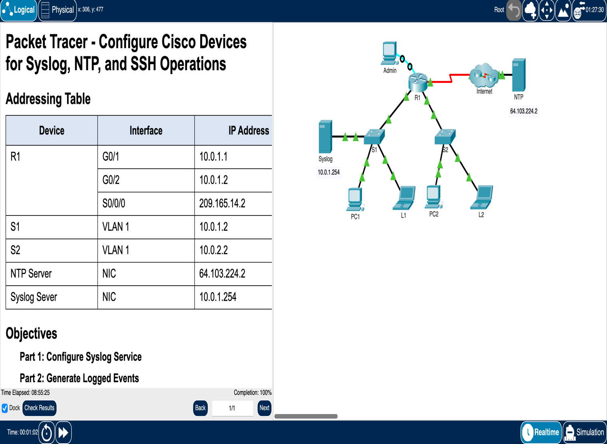

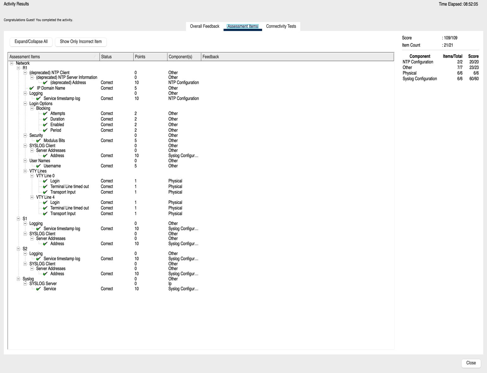

## IPv6 ACL Security

This lab implemented IPv6 ACLs to control access to a server during simulated denial-of-service conditions. The first ACL blocked HTTP and HTTPS traffic to a target server while allowing other IPv6 traffic. The second ACL filtered ICMP traffic closer to the destination to reduce ping-based DDoS activity.

Configuration highlights:

```text
ipv6 access-list BLOCK_HTTP
 deny tcp any host 2001:db8:1:30::30 eq www
 deny tcp any host 2001:db8:1:30::30 eq 443
 permit ipv6 any any

ipv6 access-list BLOCK_ICMP
 deny icmp any any
 permit ipv6 any any
```

Evidence:

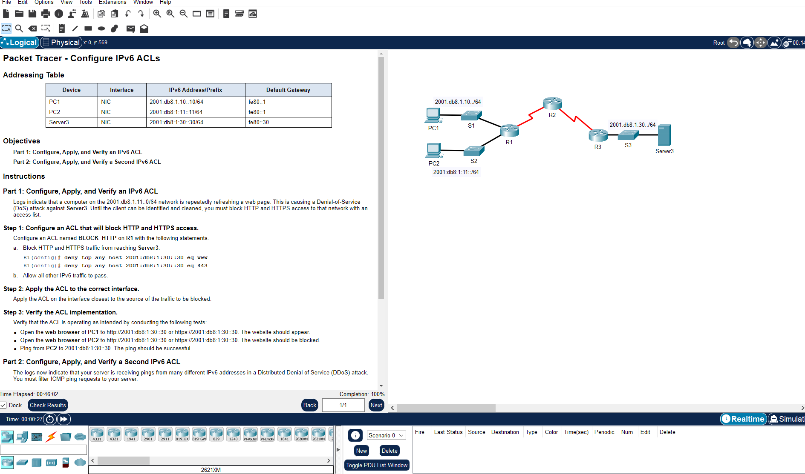

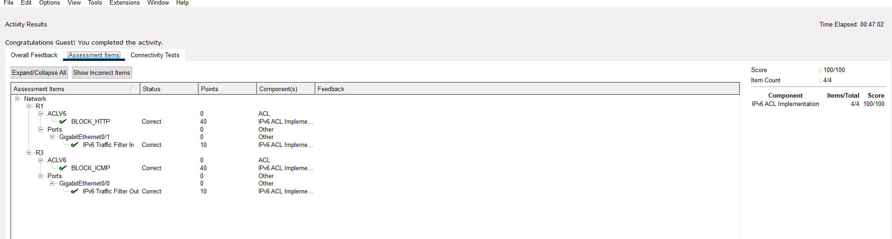

## Extended IPv4 ACLs

This lab used both numbered and named extended ACLs to enforce service-level access. PC1 was permitted to use FTP and ICMP to the server, while PC2 was permitted to use HTTP and ICMP. Other traffic was denied by default, demonstrating least-privilege filtering.

Configuration highlights:

```text
access-list 100 permit tcp 172.22.34.64 0.0.0.31 host 172.22.34.62 eq ftp
access-list 100 permit icmp 172.22.34.64 0.0.0.31 host 172.22.34.62
interface gigabitEthernet 0/0
 ip access-group 100 in

ip access-list extended HTTP_ONLY
 permit tcp 172.22.34.96 0.0.0.15 host 172.22.34.62 eq www
 permit icmp 172.22.34.96 0.0.0.15 host 172.22.34.62
interface gigabitEthernet 0/1
 ip access-group HTTP_ONLY in
```

Evidence:

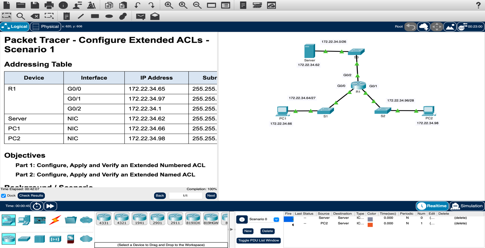

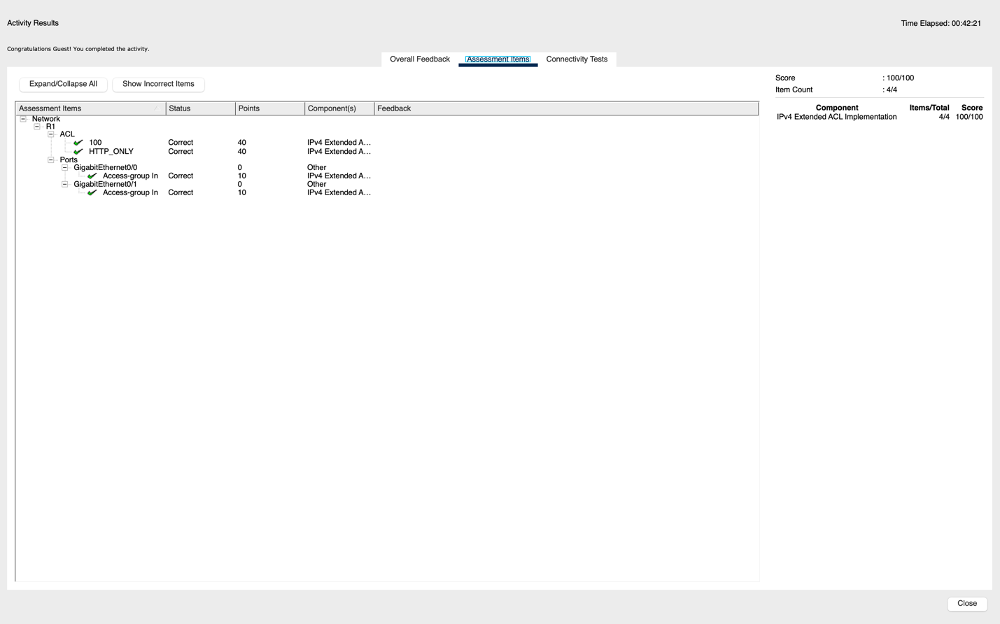

## Switch Port Security

This lab hardened switch access ports by limiting each protected port to one learned MAC address, enabling sticky MAC learning, setting violation mode to restrict, and shutting down unused ports.

Configuration highlights:

```text
interface range f0/1 - 2
 switchport port-security
 switchport port-security maximum 1
 switchport port-security mac-address sticky
 switchport port-security violation restrict

interface range f0/3 - 24, g0/1 - 2
 shutdown
```

Security outcome:

- Authorized devices remained connected on their assigned switch ports.
- A rogue laptop was blocked when connected to a protected port.
- Unused ports were administratively shut down to reduce attack surface.

Evidence:

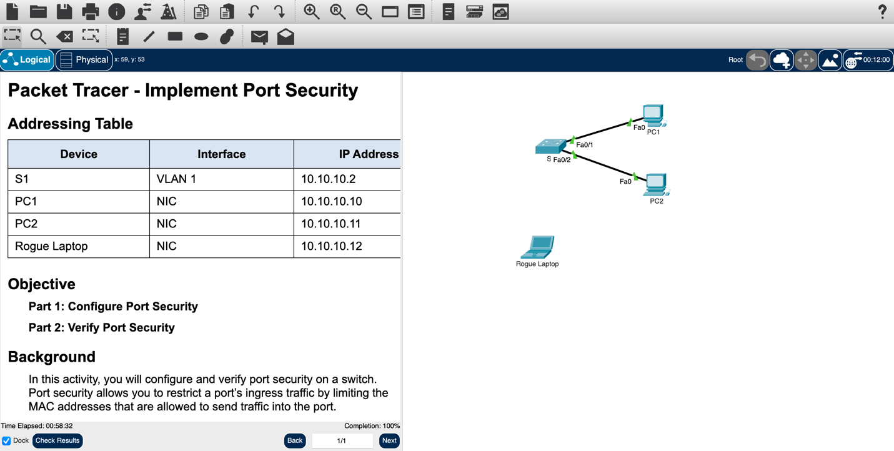

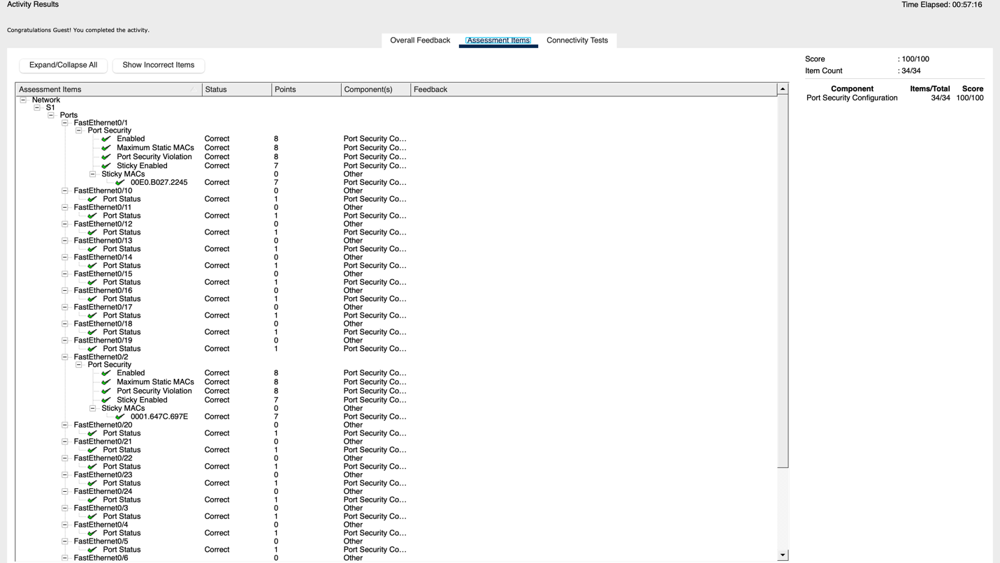

## Layer 2 VLAN Security

This lab focused on VLAN segmentation and secure management access. A redundant trunk link was configured between switches, trunk security controls were applied, VLAN 20 was created as a dedicated management VLAN, and ACLs were used to prevent unauthorized devices from reaching management resources.

Configuration themes:

- Configure trunking on redundant switch links.
- Use a dedicated native VLAN instead of default VLAN 1.
- Create a separate management VLAN.
- Assign switch virtual interfaces for managed devices.
- Permit management access only from the management PC.
- Restrict non-management VLANs from reaching the management network.

Evidence:

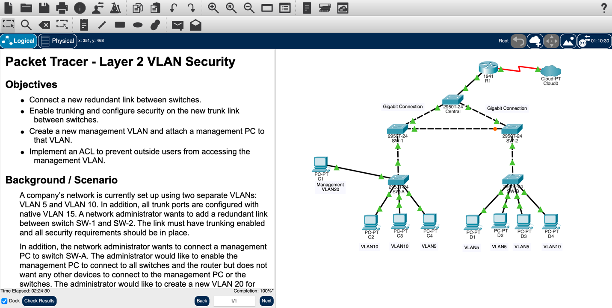

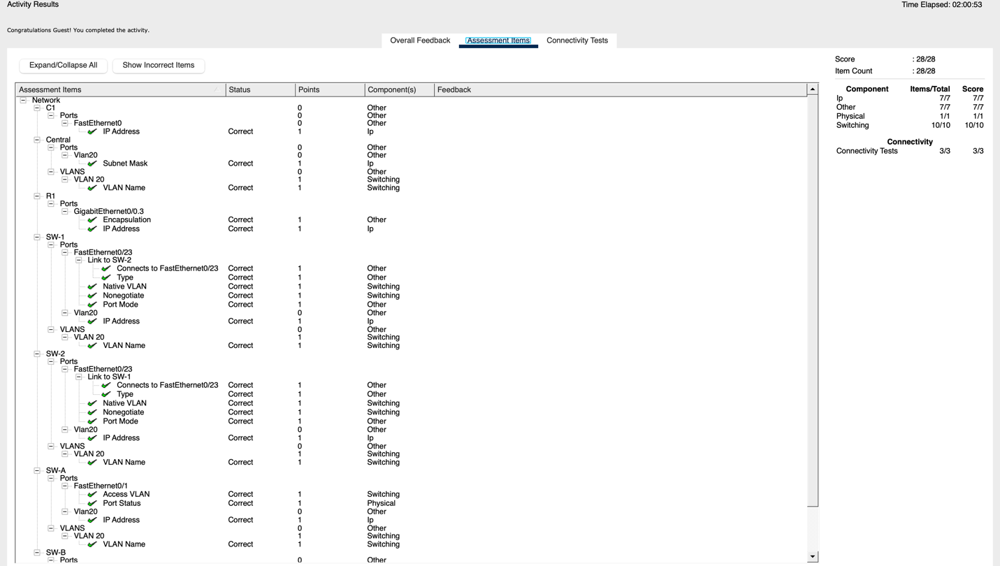

## Site-to-Site IPsec VPN

This lab configured and verified a site-to-site IPsec VPN between two routers. The VPN protected traffic between two LANs while leaving unrelated traffic outside the tunnel. The configuration included interesting traffic ACLs, ISAKMP Phase 1 policy, IPsec transform sets, crypto maps, and verification through encrypted packet counters.

Configuration highlights:

```text
access-list 110 permit ip 192.168.1.0 0.0.0.255 192.168.3.0 0.0.0.255

crypto isakmp policy 10
 encryption aes 256
 authentication pre-share
 group 5
crypto isakmp key <lab-shared-key> address 10.2.2.2

crypto ipsec transform-set VPN-SET esp-aes esp-sha-hmac
crypto map VPN-MAP 10 ipsec-isakmp
 set peer 10.2.2.2
 set transform-set VPN-SET
 match address 110

interface s0/0/0
 crypto map VPN-MAP
```

Verification approach:

- Confirm baseline connectivity before applying encryption.
- Generate interesting traffic between protected LANs.
- Use `show crypto ipsec sa` to confirm encrypted and decrypted packet counters increased.
- Verify unrelated traffic does not increment VPN counters.

Evidence:

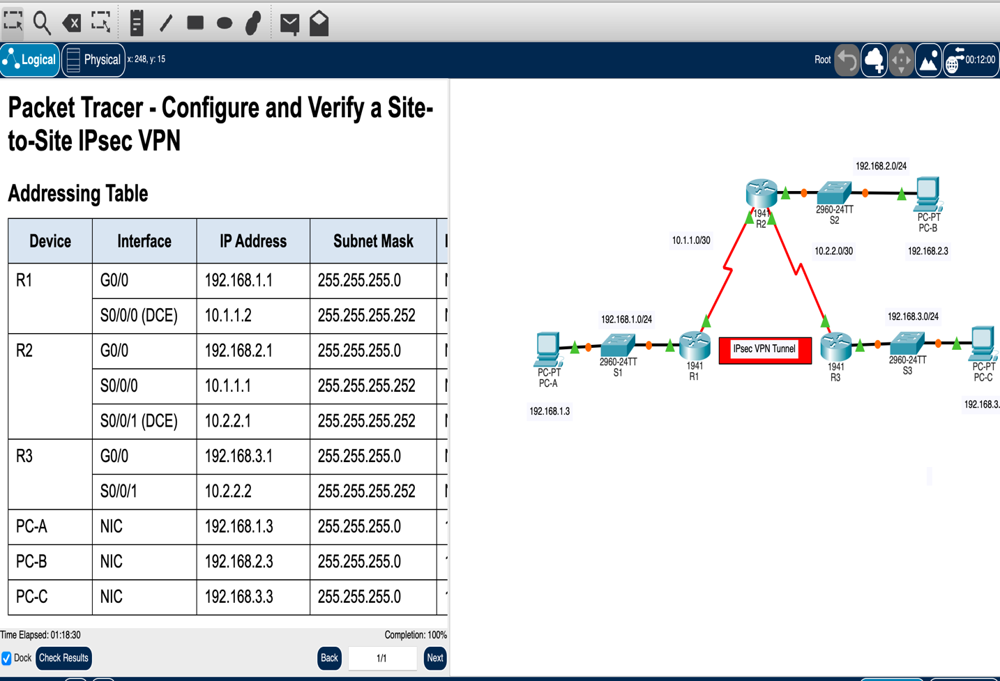

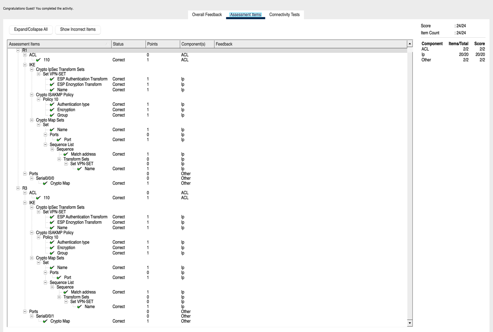

## Wireshark Packet Analysis

The repository also includes packet-analysis evidence using Wireshark. The captures show ICMP echo request and reply traffic, packet details, protocol fields, source and destination addressing, and byte-level packet inspection.


## Portfolio Summary

Together, these labs demonstrate hands-on ability to configure and validate Cisco network security controls across access, switching, routing, monitoring, and VPN use cases. The work emphasizes both implementation and verification: each configuration is paired with packet captures, Packet Tracer assessment screens, or command-based validation.
