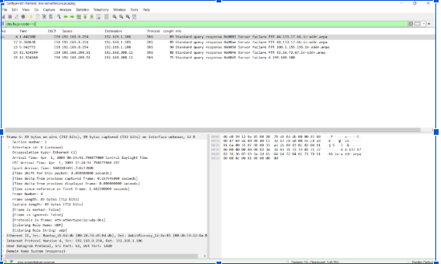
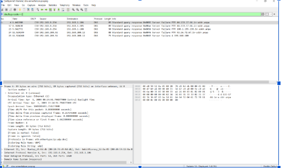

# CISCO Network Security

This repository focuses on securing networks from threats and practicing advanced Cisco device configuration, especially at Layer 2.

## Overview

CISCO Network Security is a hands-on networking security project that documents practical packet analysis, Cisco security concepts, and traffic inspection workflows. The goal is to understand how network traffic behaves, how threats can appear in packet captures, and how Cisco-based environments can be configured more securely.

## Focus Areas

- Layer 2 Cisco device security
- Network traffic inspection and packet analysis
- ICMP traffic verification
- Wireshark-based troubleshooting
- Secure switching and network defense concepts

## Packet Capture Screenshots

The screenshots below show ICMP packet captures analyzed in Wireshark.

### ICMP Capture 1

### ICMP Capture 2

## Tools Used

- Cisco networking devices
- Wireshark
- Packet capture analysis
- Network security configuration practice

## Project Goal

The goal of this project is to build a clear understanding of Cisco network security through practical configuration, monitoring, and analysis of real network traffic.
